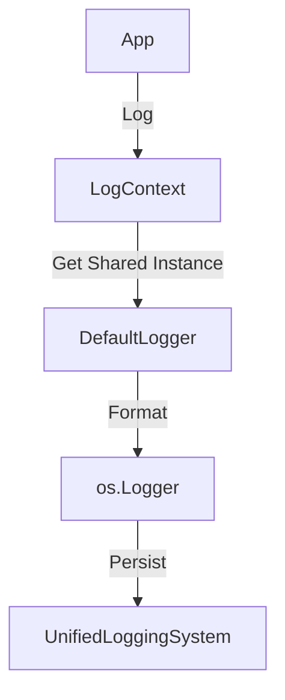

# Logger | The Black Box

**Technical White Paper**
**Package Version: 1.0**

---

## 1. Executive Summary
**Logger** provides a unified, structured logging interface for the Canvas framework. It wraps Apple's `os.Logger` to enforce consistent subsystem naming, privacy rules, and log levels across all packages.

## 2. Core Responsibilities
-   **Structured Logging**: Categorizing logs by Subsystem (e.g., `com.canvas.store`) and Category (e.g., `Encryption`).
-   **Privacy**: Ensuring sensitive user data is redacted or marked as `.private` in the console.
-   **Performance**: Zero-overhead logging when not attached to a debugger.

## 3. Architecture
The package exposes a lightweight wrapper:



## 4. Key Components

### 4.1. LogContext
A struct that captures the "Context" of a log source.
-   **Init**: `let log = LogContext("STOR")` -> Maps to `com.canvas.store`.
-   **Levels**: `debug`, `info`, `warning`, `error`, `fault`.

### 4.2. Privacy Rules
-   ****: Static strings, error codes, state enums.
-   **Private**: User input, sensor values, file paths.

## 5. Usage
```swift
let log = LogContext("MECH")
log.info("Starting training...")
log.debug("Accuracy: \(accuracy, privacy: .)")
```
